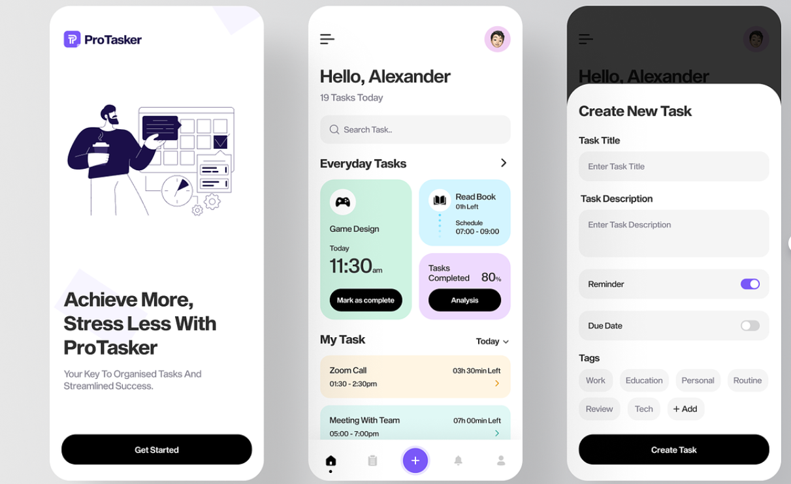

# ProTasker Application

ProTasker is a mobile app designed to help users manage their tasks efficiently, providing a streamlined experience for improved productivity and organization.

## Features

- **Task Management**: Easily create, edit, and delete tasks.
- **Intuitive Interface**: User-friendly design for a seamless experience.
- **Categories**: Organize tasks into categories for better classification.
- **Notifications**: Receive reminders for upcoming tasks.
- **Dark Mode**: Conveniently switch between light and dark themes.
- **User Authentication**: Securely log in and manage tasks associated with your account.

## Screenshots

## Contact
Author: Mehdi Forkani
Email: your.email@example.com
Social Media: @forknimahdi

## License
This project is licensed under the MIT License - see the LICENSE file for details.